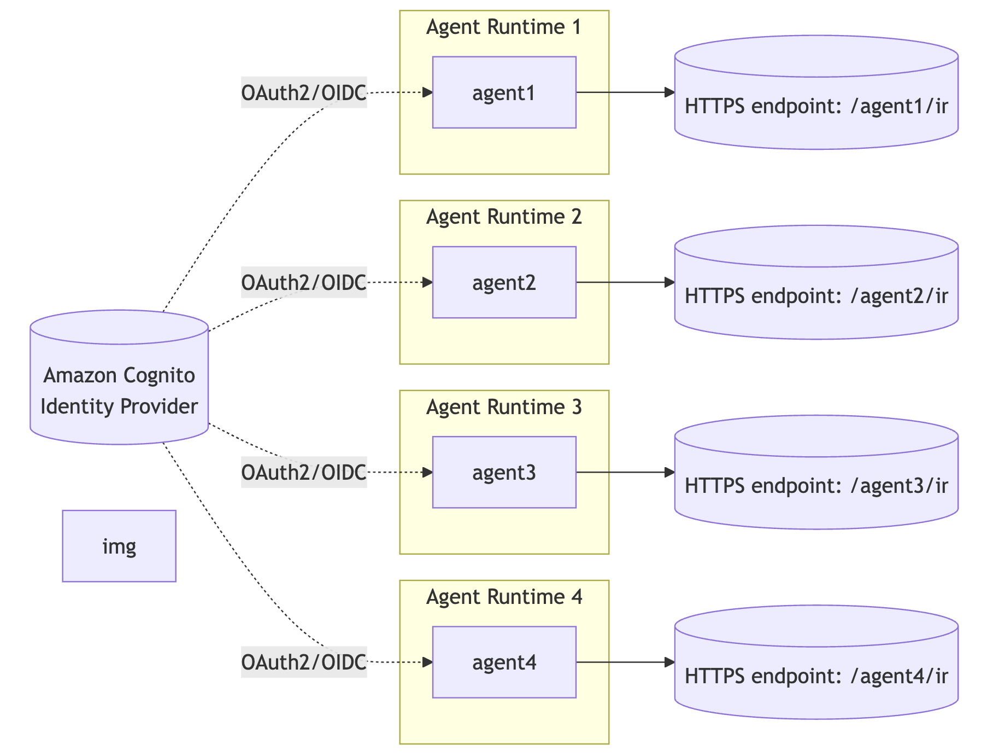

# Enterprise IT Support Domain Agents

## Overview

This directory contains domain-specific agents for the Enterprise IT Support multi-agent assistant system. Each agent is designed to handle queries related to specific IT services and provides intelligent routing signals back to the orchestrator.

## Available Agents

- **Infrastructure Agent**: Handles queries about cloud infrastructure (AWS, Azure, GCP), networking, servers, and infrastructure management
- **Development Tools Agent**: Answers questions about CI/CD pipelines, GitHub Enterprise, Docker, Kubernetes, and development tooling
- **Database Agent**: Supports database management, PostgreSQL, MySQL, query optimization, and data operations
- **Service Desk Agent**: Manages general IT support requests, user account issues, software installation, and help desk operations

## Agent Architecture



### Core Functionality

Each domain agent provides two primary capabilities:

1. **Product-Specific Responses**: Answers questions within its domain expertise based on custom prompts that contain detailed product information

2. **Plugin Signal Communication**: Returns structured response types to the orchestrator for intelligent routing and session management

### Plugin Signal Response Types

Agents communicate with the orchestrator using these signals:

| Signal | Purpose | Behavior |
|--------|---------|----------|
| `more_info_needed` | Request additional information from user | Maintains sticky session between user and domain agent |
| `out_of_scope` | Question is outside agent's expertise | Returns control to orchestrator to route to appropriate agent |
| `error` | Processing error occurred | Returns control to orchestrator for error handling |
| `completed` | User interaction is complete | Closes sticky session after user confirms satisfaction |

### Sticky Session Management

When an agent returns `more_info_needed`, the orchestrator maintains a **sticky session**:
- User continues interacting directly with the domain agent
- Session persists until agent returns `completed` signal
- Agent only returns `completed` after user confirms their questions are answered

When `out_of_scope` or `error` is returned:
- Orchestrator retrieves available tools via gateway
- Orchestrator reasons about which agent to invoke next
- May route to fallback/default agent if no suitable agent found

## Agent Prompt Example

Each agent uses a custom prompt defining its expertise. For example, the Infrastructure Agent prompt includes:

- Scope definition (cloud infrastructure, networking, server management, security, monitoring)
- Response criteria and routing logic
- JSON response format requirements
- Conversation flow examples

See `infrastructure_agent/agent_prompts/infrastructure_agent_prompt.txt` for a complete example.

## Deployment Options

### Option 1: Amazon Bedrock AgentCore Runtime

1. Navigate to each of the agent directories (e.g., `infrastructure_agent`, `development_tools_agent`, etc.)
2. Follow the steps here to deploy the agents on Bedrock AgentCore runtime: https://docs.aws.amazon.com/bedrock-agentcore/latest/devguide/getting-started-starter-toolkit.html#starter-toolkit-deploy-to-agent-runtime. 
3. Configure each agent (add the agent `IdP` information that can be fetched from the `agent_idp` folder/existing `IdP` information), launch the agent and get the agent `url` for that agent.

Agents are deployed as Bedrock AgentCore services with:
- Agent ARN identifier
- HTTPS endpoint for invocations
- AWS credentials for authentication

Use `get_agent_url.py` to convert an Agent ARN to an invocation URL:

```python
python get_agent_url.py
# Input: arn:aws:bedrock-agentcore:region:account:agent/agent-id
# Output: https://bedrock-agentcore.{region}.amazonaws.com/runtimes/{escaped_arn}/invocations?qualifier=DEFAULT
```

### Option 2: Existing HTTPS Services

If you already have agents deployed as HTTPS services:
- Skip the AgentCore deployment step
- Ensure agents implement the plugin signal response types
- Configure orchestrator with your agent endpoints
- Agents must return `more_info_needed`, `out_of_scope`, `error`, or `completed` signals

## Response Format

All agents return JSON responses with this structure:

```json
{
  "response_type": "more_info_needed|out_of_scope|error|completed",
  "response_message": "Human-readable response text"
}
```

## Integration with Orchestrator

The orchestrator system:
1. Receives user queries
2. Routes to appropriate domain agent
3. Processes plugin signals
4. Manages sticky sessions
5. Re-routes when necessary based on signals

This architecture enables intelligent multi-turn conversations while maintaining clear separation between domain expertise and routing logic.

## Next Steps

Provide information about the existing agents or the newly created agents, available as `HTTPS` endpoints to the orchestrator system. These endpoints will be used to be registered as agents or MCP servers within `AgentCore Gateway`. If you already have the `HTTPS` endpoints for the existing agents, then bring in their authentication information as well (if it is `OAuth2.0` based authentication, then provide the `client_id`, `discovery URL`, `client secret` and the `scopes` that are required to get the access token).  

Once done with this step, move forward to the next step, which is registering the agents with the `AgentCore Gateway`. For this, we need the Agent `HTTPS` endpoints and the authentication information (if any) to register the agents with the `AgentCore Gateway`. Move to the agent gateway registration step [here](../agent_gateway/README.md).